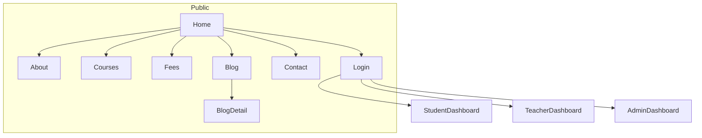

# Quran Academy — Static Website Design Plan

Build a **frontend-only** site (HTML, CSS, JavaScript). Pages will look and feel complete. Login, dashboards, forms, chatbot, and WhatsApp will work visually with demo data — no server or database.

## Design direction

**Feel:** calm, trustworthy, premium — like a modern madrasa brand, not a busy Islamic wallpaper site.

**Palette (CSS variables):**
- Deep emerald (`#0F3D34`) — primary, header, CTAs
- Soft gold (`#C9A227`) — accents, icons, thin rules
- Cream (`#F7F3EA`) — page background
- Warm white (`#FFFcf7`) — cards
- Charcoal (`#1C1917`) — body text
- Sage (`#E8F0EC`) — section bands

**Typography:**
- Headings: elegant serif (e.g. *Playfair Display* or *Cormorant Garamond*)
- Body: clean sans (*DM Sans* or *Outfit*)
- Optional Arabic display font (*Amiri* / *Noto Naskh Arabic*) for verse-of-the-day and decorative phrases only

**Islamic touch (minimal, not heavy):**
- Thin geometric star / octagon motifs as section dividers, not full-page patterns
- Gold crescent or book-mark icon as logo mark
- Subtle arabesque border on hero and card hover
- Generous whitespace, rounded-2xl cards, soft shadow
- RTL-ready CSS variables so an EN/AR toggle can be added later

**Layout:** sticky header + floating WhatsApp + chatbot. Max content width ~1200px. Mobile-first.

## Suggested extra ideas (included in v1)

These fit the same design and stay frontend-only:

- **Verse of the day** on Home (static verse + translation)
- **Teacher highlight strip** (certified, Ijazah, Tajweed, Hifz)
- **Free trial class** CTA on Home and Fees
- **Kids vs adults** course tracks
- **FAQ accordion** on Home and Fees
- **Live-class schedule preview** (demo timetable)
- **Certificate teaser** on student dashboard
- **EN / AR language toggle** (visual switch; English content first, Arabic labels on key chrome)
- **Prayer-time strip** in footer (static cities, e.g. Karachi / London / New York)

Deferred (nice later, not v1): real payments, Zoom/Meet, LMS video player, email, CMS.

## Site map



## File structure

```
quran-acadamy/
  index.html
  about.html
  courses.html
  fees.html
  blog.html
  blog-post.html
  contact.html
  login.html
  student-dashboard.html
  teacher-dashboard.html
  admin-dashboard.html
  css/style.css
  js/main.js          # header/footer inject, nav, language toggle, FAQ
  js/chatbot.js       # canned FAQ bot
  js/demo-data.js     # reviews, courses, posts, dashboard numbers
  assets/icons/       # SVG logo, patterns, whatsapp
```

Shared **header + footer** injected by `js/main.js` so every page stays consistent without a backend.

## Pages

### 1. Home (`index.html`)

Hero: cream background, geometric corner motif, headline **“Learn Quran with certified teachers”**, short subcopy, two CTAs: **Start free trial** and **View courses**. Small trust row: Certified teachers · Live 1:1 · Flexible timing.

Sections in order:
- **How it works** — 3–4 steps: Register → Placement chat → Live class → Progress
- **Get started tutorial** — short interactive stepper (click through 4 cards: account, pick course, meet teacher, first class). This is the “basic tutorial”
- **Courses snapshot** — 3 featured cards linking to Courses
- **Teachers** — 3–4 profile cards with specialty (Tajweed, Hifz, Kids)
- **Reviews** — 4–6 testimonials, star rating, student name + country (static)
- **Verse of the day** — one ayah + translation in a quiet gold-bordered panel
- **FAQ** — accordion
- **Final CTA** — WhatsApp + “Talk to us” contact

**WhatsApp:** floating round button (bottom-left) → `https://wa.me/PHONE` (placeholder number). Tooltip: “Ask about a free trial”.

**Chatbot:** floating button (bottom-right). Panel with canned replies:
- Course types, fees, trial class, timing, kids vs adults, how to join
- “Talk to a human” → opens WhatsApp

### 2. About (`about.html`)

Mission, how the academy teaches (Tajweed, Hifz, Tafsir lite), teacher standards (Ijazah / certification copy), values, a simple timeline (Founded → First online batch → Global students). No fake long history — keep it honest and short.

### 3. Courses (`courses.html`)

Filter chips: All · Kids · Adults · Tajweed · Hifz · Recitation · Arabic basics.

Cards: title, level, duration, class length, “from $X/month”, **Enroll** → login (visual). Optional detail modal (demo content).

### 4. Fee plan (`fees.html`)

3 columns: **Starter** (group), **Standard** (1:1), **Hifz Track** (intensive). Gold outline on recommended plan. Note: family discount, sibling pack, free trial. FAQ for refunds / missed classes (static copy).

### 5. Blog (`blog.html` + `blog-post.html`)

Grid of 6 demo posts (Tajweed tips, how kids learn, teacher spotlight). Post page: title, date, cover band, article body, related posts. Content is placeholder articles, not a CMS.

### 6. Contact (`contact.html`)

Visual form (name, email, role: student/teacher, message). On submit: success toast, no email send. Side panel: WhatsApp, email placeholder, hours. Small map embed optional (or illustrated location card).

### 7. Login (`login.html`)

Minimal card: email + password (any values accepted). Role tabs: **Student · Teacher · Admin**. Submit routes to the matching dashboard. “Register” is a second visual tab (student/teacher only) — no real accounts.

## Dashboards (visual only)

Shared dashboard chrome: side nav, top bar (search dummy, notifications dummy, profile), cream/sage panels.

**Student**
- Greeting + next class card
- Progress rings (Tajweed, memorization, attendance) — CSS, demo %
- Upcoming timetable
- Assigned homework list
- Certificate teaser
- Quick WhatsApp to teacher (visual)

**Teacher**
- Today’s classes
- Student list (demo names, levels)
- Attendance toggle (UI only)
- Homework assign form (UI only)
- Earnings/summary cards (demo numbers)

**Admin**
- KPI cards: students, teachers, classes this week, inquiries
- Recent enrollments table
- Blog posts list (view-only)
- Contact messages inbox (demo)
- Teachers pending approval (approve/reject buttons, no persist)

## Interaction (JavaScript only)

- Mobile nav, FAQ accordion, course filters
- Login role routing
- Chatbot keyword matching
- Tutorial stepper
- Form success toasts
- Language toggle: flips `dir` and a few header/footer strings (English remains main copy)

No localStorage auth required; dashboards are open pages. Login is a visual gateway.

## Copy and placeholders

Use respectful, clear English. Avoid inventing religious rulings. Demo names, fees, and phone number clearly marked as sample so you can swap them later.

## What you will get

A clickable multi-page site you can open in a browser, with a unified Islamic-modern look, all requested pages, WhatsApp, chatbot, reviews, tutorial, and three role dashboards. Ready to hand to a developer later for a real backend (auth, payments, live classes).
